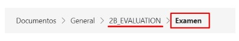
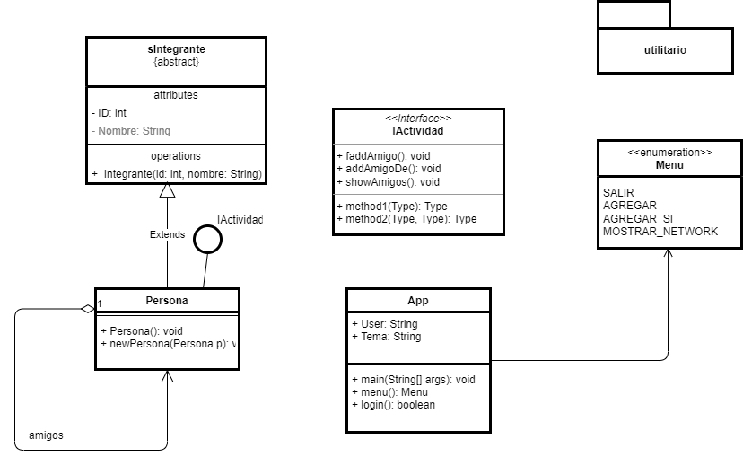

<h1>
 Examen final 
</h1> 

**Nombre:** 
    *David Calahorrano*

**Curso:**
    *GR2COM*

**Período:**
    *2022-A*

**Materia:**
    *Programación II*

**Docente:** 
    *Ing. Patricio Paccha*

**Fecha:** 
    *01/09/2022*

____________

## Indicaciones
1. Leer cuidadosamente la presente rúbrica.
2. Incluir la presente rúbrica en su proyecto/solución.
3. Se calificará únicamente los exámenes entregados en el tiempo especificado.
4. Encender la cámara durante el examen.
5. Exámenes copiados parcial o total anula su examen.
6. El nombre del proyecto/solución debe ser: el nombre de su Correo electrónico (nombre.apellido@epn.edu.ec) y subido al
Teams :

## Repositorio
- [Examen2B_GR2COM]()

### Procedimiento
Desarrollar una red social (network) acorde al diagrama UML descrito. Tema de su elección

delimitar 
1 - 1
1 - ..*
..* - ..*

Agregaci'on -> Una clase no depende de la otra
Composicion -> Una clase si depende de la otra

